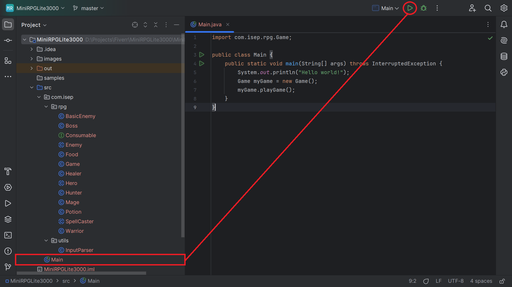
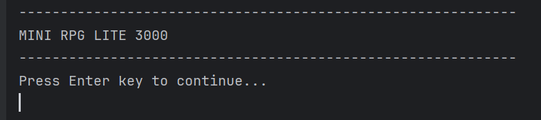
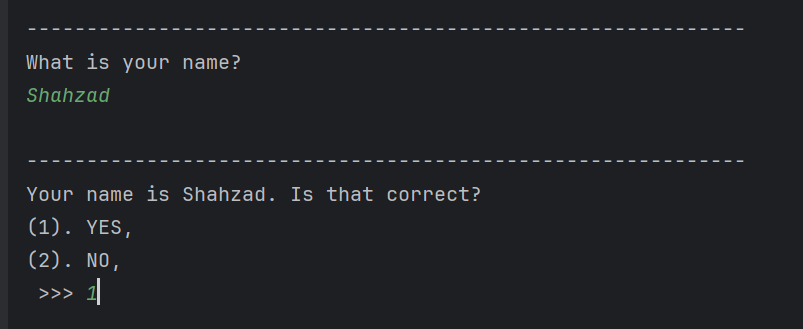
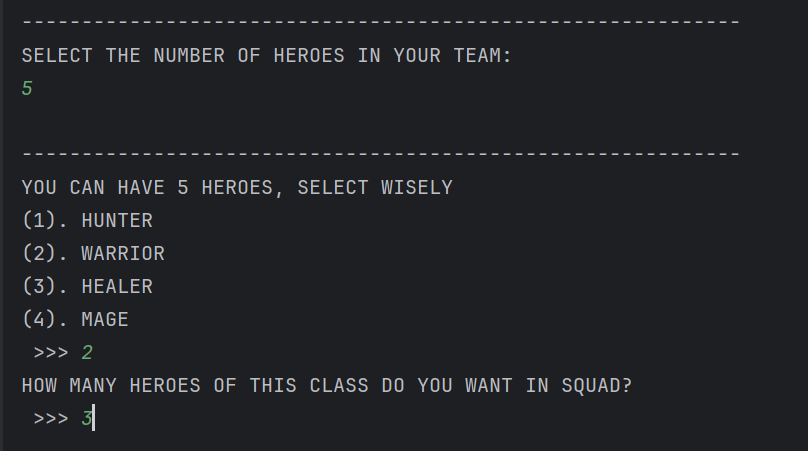
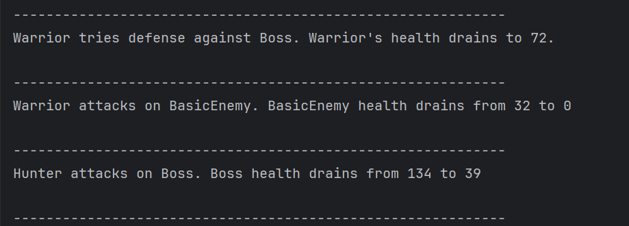
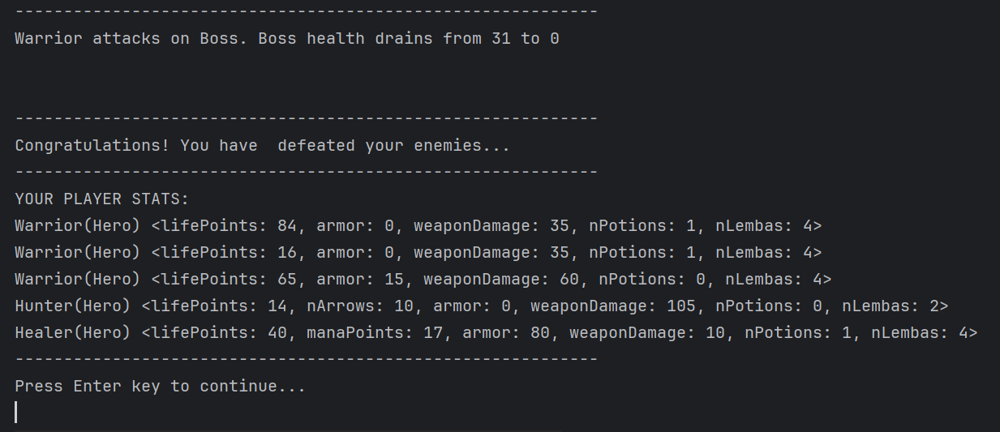
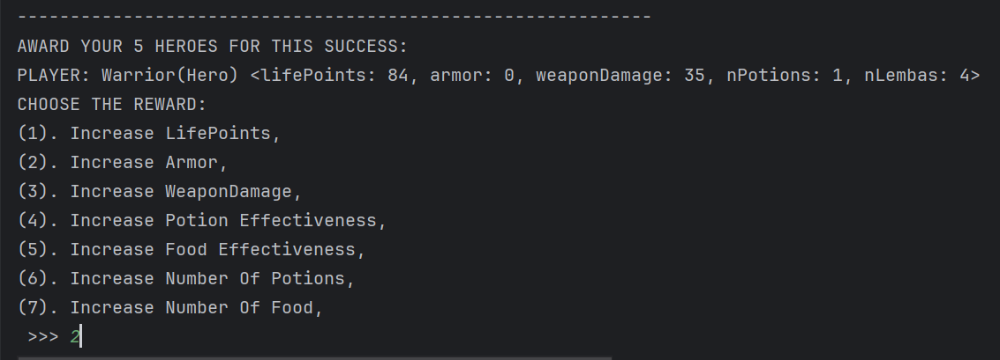
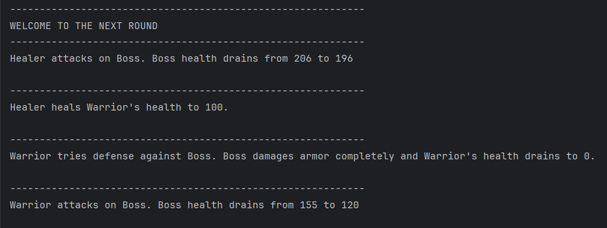
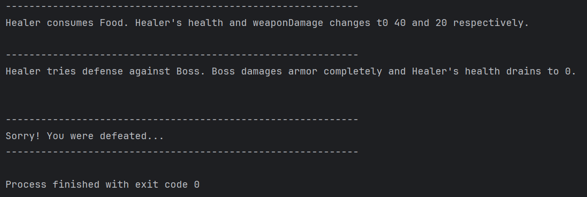

# RPGLite3000

## Introduction

**RPGLite3000** is a text-based RPG simulation developed in Java. This command-line game allows you to assemble and command an army of heroes in an epic battle against waves of enemies. Choose your heroes wisely, fight strategically, and upgrade your army as you progress through increasingly challenging rounds.

## Table of Contents

1. [Game Overview](#game-overview)
   - [Key Features](#key-features)
2. [Hero Classes](#hero-classes)
   - [Mage](#1-mage)
   - [Healer](#2-healer)
   - [Hunter](#3-hunter)
   - [Warrior](#4-warrior)
3. [Enemies](#enemies)
4. [Game Mechanics](#game-mechanics)
   - [Combat](#combat)
   - [Rewards](#rewards)
   - [Endless Progression](#endless-progression)
5. [Getting Started](#getting-started)
   - [Prerequisites](#prerequisites)
   - [Installation](#installation)
6. [Gameplay Screenshots](#gameplay-screenshots)
7. [License](#license)

## Game Overview

In **RPGLite3000**, you are tasked with forming a team of heroes from a pool of distinct classes, each with unique abilities. Once assembled, your team will face off against different types of enemies in turn-based combat. If your heroes survive, you can award them with armor, arms and health that will help them in future battles.

### Key Features:
- **Hero Selection**: Choose from four different classes: Mage, Healer, Hunter, and Warrior.
- **Turn-Based Combat**: Heroes and enemies act randomly, making each battle unique.
- **Reward System**: Reward/Upgrade your heroes after each successful battle.
- **Progressive Difficulty**: Each new round introduces stronger enemies, testing your strategy and management skills.

## Hero Classes

### 1. Mage
- **Role**: Offensive
- **Abilities**: Deals powerful magical attacks that can heavily damage enemies.

### 2. Healer
- **Role**: Support/Defensive
- **Abilities**: Heals themselves and other heroes, ensuring the team stays strong during combat.

### 3. Hunter
- **Role**: Ranged Attacker
- **Abilities**: Uses a bow and arrow for long-range attacks, dealing damage from a distance.

### 4. Warrior
- **Role**: Tank
- **Abilities**: Equipped with heavy armor and powerful mêlée attacks, excels at absorbing enemy damage.

## Enemies

The game features two main types of enemies:

- **Basic Enemy**: Common adversaries that appear in large numbers. They have moderate health and damage.
- **Boss**: Elite enemies with high health and damage. They are much tougher and require careful strategy to defeat.

## Game Mechanics

### Combat
- **Turn-Based System**: Battles are mostly turn-based, with both heroes and enemies performing random actions such as attacking, defending, or using consumables like potions and food.
- **Consumables**: Heroes can use potions to heal themselves or boost their stats, and food to restore energy and enhance their abilities.
- **Unpredictable Combat**: The randomized nature of actions makes each battle unpredictable and adds excitement to the game.

### Rewards
- After winning a battle, you can upgrade your heroes by:
    - Increasing their life points, armor, or weapon damage.
    - Adding more potions and food to their inventory.
    - Boosting the effectiveness of potions, food, and other items.

### Endless Progression
- The game consists of infinite rounds, with each round increasing in difficulty. Stronger enemies appear in each new round, making resource management and hero upgrades critical to survival.

## Getting Started

### Prerequisites

- Ensure you have Java installed on your machine.

### Installation

1. **Clone the repository**:
   ```bash
   git clone https://github.com/shaizCodes/RPGLite3000.git
   ```

2. **Navigate to the project directory:**
   ```bash
   cd MiniRPGLite3000
   ```

3. **Open the Project in IntelliJ IDEA:**
   - Launch IntelliJ IDEA.
   - Click on `File > Open` and navigate to the cloned repository's root folder.
   - IntelliJ IDEA will automatically detect the project structure and configure it as a Java project.

4. **Configure the Project SDK:**
    - Once the project is loaded, make sure the correct SDK is configured.
    - Go to `File > Project Structure > Project` and ensure that your Project SDK is set to a compatible JDK, preferably 21 or higher.

5. **Build the Project:**
    - After ensuring the SDK is configured, build the project by going to `Build > Build Project` or pressing `Ctrl+F9`.
    - This will compile all the source files and ensure everything is set up correctly.

6. **Run the Game:**
    - To run the game, navigate to the `Main` class under src folder.
    - 
    - Pressing `Shift + F10` or by clicking play button will launch the game in the IntelliJ terminal as a command-line interface.

## Gameplay Screenshots

Here are some sample screens from the MiniRPGLite3000 game:

   - **Game Introduction**
   
   - **Name Prompt and Confirmation**
   
   - **Army Strength and Heroes Selection**
   
   - **Battlefield Commentary**
   
   - **Battlefield Victory**
   
   - **Rewarding Victors**
   
   - **Next Battlefield Commentary**
   
   - **Battlefield Defeat**
   

These visuals provide a visual reference to the game's interface and gameplay. 

## License

This project is licensed under the MIT License. See the [LICENSE](LICENSE) file for details.
